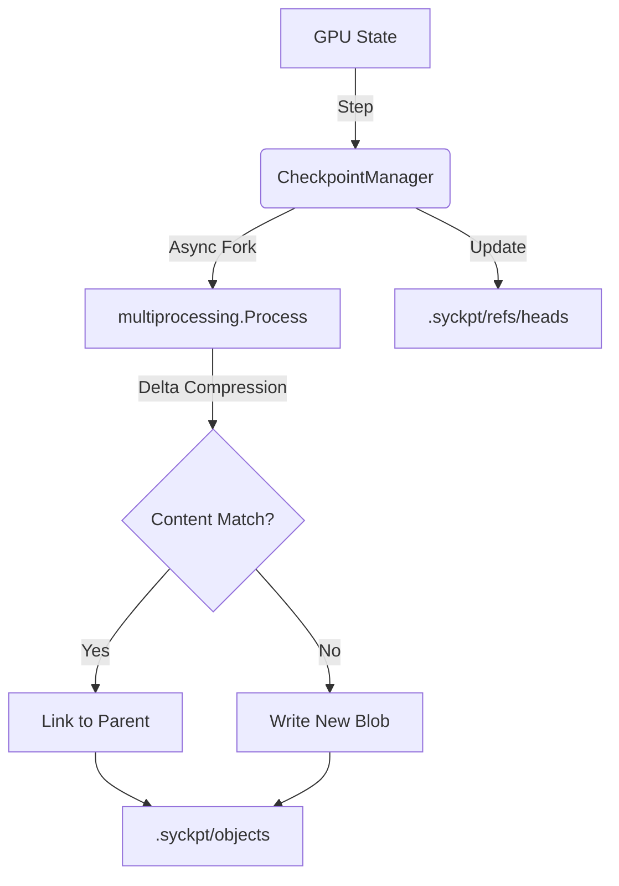

# Syckpt: Git for Tensors

**Efficient, Exact, and Asynchronous Experiment Tracking for Deep Learning.**

`syckpt` is a lightweight version control system for computational states. It treats your models, optimizers, and dataloaders as a versioned tree of content-addressable nodes, enabling **Exact Mathematical Resumption** with **Zero Storage Bloat**.

---

## 🧠 The Core Philosophy: "Everything is a Pointer"

Traditional checkpointing saves a monolithic blob (`model.pt`) every epoch. If your model is 10GB, 50 epochs = 500GB of redundant data.

`syckpt` functions like Git:
1.  **State Flattening**: It breaks your model into individual layer tensors.
2.  **Content-Addressable Storage (CAS)**: It hashes every tensor. If a layer hasn't changed (frozen backbone), it only stores a pointer to the existing data.
3.  **Delta Compression**: If a layer changes slightly, it only stores the mathematical difference ($\Delta W$).
4.  **Merkle Tree Root**: Your "checkpoint" is just a tiny JSON file containing pointers to these immutable chunks.

### The Anatomy of `.syckpt`
When you initialize a manager, it creates a hidden directory:
*   `.syckpt/objects/`: A database of immutable tensor "blobs" and JSON "commit" nodes.
*   `.syckpt/refs/heads/`: Pointers to the latest commit on specific branches (e.g., `main`, `trial_01`).

---

## 🚀 Quick Start (The 3-Step Integration)

### 1. Register
Attach your components to the `CheckpointManager`. It uses Python proxies to track them automatically.

### 2. Step
Increment the global training step. This ensures RNG states and sampler indices stay synchronized.

### 3. Save
Trigger an asynchronous commit. `syckpt` forks a background process to handle the math and I/O, so your GPU never stalls.

```python
import torch
from syckpt import CheckpointManager
from syckpt.dataloader import StatefulRandomSampler

# Setup your standard PyTorch objects
model = torch.nn.Linear(10, 2)
dataset = MyDataset()
sampler = StatefulRandomSampler(dataset, batch_size=32)

# 1. Initialize and Register
with CheckpointManager("./experiments") as ckpt:
    ckpt.model = model
    ckpt.sampler = sampler

    # 2. Loop with Resumption
    for epoch in ckpt.loop(epochs=10):
        for batch in sampler:
            # Training logic...
            
            # 3. Synchronize and Save
            ckpt.step_up()
        
        ckpt.save()
```

---

## 🛠️ Advanced Performance Features

### ⚡ Asynchronous Multiprocessing Saves
Unlike standard `torch.save`, which locks your GPU while the CPU writes to disk, `syckpt` forks a **background OS process**. 
*   **How**: It clones tensors to CPU RAM and detaches. 
*   **Result**: Your GPU returns to training in milliseconds, while the background process handles delta compression and disk I/O.

### ❄️ Sub-Layer Freezing
If you are doing Transfer Learning (e.g., freezing a ResNet backbone), `syckpt` detects the `requires_grad=False` flag.
*   **How**: It creates a "virtual hard-link" to the base weights.
*   **Result**: Storage cost for the backbone drops to **0 bytes** per checkpoint.

### 🎯 Exact $O(1)$ Resumption
If your training crashes at Step 500,000, `syckpt` doesn't iterate through 500,000 batches to "catch up."
*   **How**: It uses a `StatefulRandomSampler` that performs a native C-level pointer slice on the randomized index array.
*   **Result**: Resumption is instantaneous, and RNG states are perfectly restored.

---

## 📊 The `syckpt` Pipeline



---

## 📚 Deep Dives

For a detailed mathematical and architectural breakdown, see our internal reports:

*   **[Implementation Overview](docs/implementation.md)**: The structural map of the codebase.
*   **[Storage & CAS](docs/storage_and_cas.md)**: How deltas and hard-links work.
*   **[Manager & DDP](docs/manager_and_ddp.md)**: Distributed synchronization and Async I/O.
*   **[Dataloader & Resumption](docs/dataloader_and_resumption.md)**: $O(1)$ sampling and RNG mechanics.
*   **[Hash & LSH](docs/config_and_lsh.md)**: Hyperparameter bucketing and search.
*   **[State & PRNG](docs/state_aggregation.md)**: The physics of random seeds.
