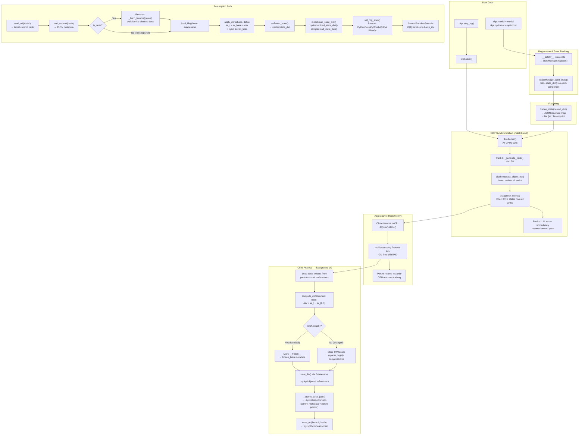

# Syckpt: Git for Tensors

**Efficient, Exact, and Asynchronous Experiment Tracking for Deep Learning.**

`syckpt` is a lightweight version-control system purpose-built for computational states. It treats your models, optimizers, learning-rate schedulers, and dataloaders as a versioned tree of **content-addressable nodes** — the same paradigm that powers Git — enabling **Exact Mathematical Resumption** with **Zero Storage Bloat**.

| Feature | `torch.save` | `syckpt` |
|---|---|---|
| Storage per checkpoint | Full copy (10 GB) | Delta only (≈ 50–200 MB) |
| Frozen backbone cost | Full copy (10 GB) | 0 bytes (virtual hard-link) |
| GPU stall during save | Yes (blocks training) | No (async OS process) |
| Crash resumption | Re-iterate dataloader | $O(1)$ list slice |
| DDP-safe | Manual `if rank == 0` | Built-in barrier + broadcast |

---

## The Core Philosophy: "Everything is a Pointer"

Traditional checkpointing saves a monolithic binary blob (`model.pt`) every *N* steps. If your model weighs 10 GB and you checkpoint 50 times, you have **500 GB of almost-identical data** sitting on disk.

`syckpt` borrows the four key ideas from Git's object model and applies them to floating-point tensors:

### 1. State Flattening
PyTorch state dictionaries are deeply nested Python objects:

```python
# A typical optimizer state_dict structure:
{'state': {0: {'momentum_buffer': tensor(...)}, 1: {...}}, 'param_groups': [...]}
```

`syckpt` recursively walks this tree, extracts every `torch.Tensor` into a **flat `str → Tensor` dictionary** (required by the [Safetensors](https://github.com/huggingface/safetensors) format), and replaces each tensor in the original structure with a lightweight JSON pointer `{"__tensor__": "state.0.momentum_buffer"}`. The result is two objects: a tiny JSON metadata map and a flat tensor blob — analogous to Git separating tree objects from blob objects.

### 2. Content-Addressable Storage (CAS)
Every tensor blob is addressed by a **hash** derived from the model's architecture and hyperparameter configuration via Locality-Sensitive Hashing (LSH). Identical content always maps to the same address. If a tensor hasn't changed between two checkpoints (e.g., a frozen backbone layer), `syckpt` stores **zero additional bytes** — it writes a virtual hard-link in the commit metadata pointing back to the existing blob, exactly like `git` stores unchanged files as pointers to existing tree entries.

### 3. Delta Compression
In standard Stochastic Gradient Descent (SGD), the weight update rule is:

$$W_t = W_{t-1} - \eta \nabla L(W_{t-1})$$

Because the learning rate $\eta$ is small (typically $10^{-3}$ to $10^{-5}$), the element-wise difference $\Delta W = W_t - W_{t-1}$ is **extremely sparse** — most values cluster tightly around zero. `syckpt` computes this difference tensor and saves only $\Delta W$ instead of the full $W_t$. Sparse tensors compress dramatically under Safetensors' internal LZ4/zstd encoding, often achieving **10–50× size reduction** compared to storing the raw weights.

### 4. Merkle Tree Root — Your "Checkpoint" is a JSON Pointer
In Git, a commit is a tiny text file that points to a tree hash. In `syckpt`, a **commit** is a tiny JSON file that records:
- A `parent` pointer (the previous commit's hash, forming a linked list / Merkle DAG)
- A `blob_hash` pointing to the Safetensors file in `.syckpt/objects/`
- A `blob_metadata` dict recording whether this blob is a delta and which layers are frozen
- Training metadata: `step`, `epoch`, `batch_idx`, `config`, `rng` states

To restore any historical checkpoint, `syckpt` walks the parent chain backwards (like `git log`), recursively applying deltas until it arrives at a full base snapshot, then reconstructs the weights: $W_t = W_{\text{base}} + \Delta W$.

### The Anatomy of `.syckpt/`
When you initialize a `CheckpointManager`, it creates a hidden directory:

```
.syckpt/
├── HEAD                    # Symbolic ref: "ref: refs/heads/main"
├── objects/
│   ├── a3f8c1d2.json       # Commit metadata (parent, blob_hash, step, epoch, rng, config)
│   ├── a3f8c1d2.safetensors # Tensor blob (full snapshot or delta)
│   ├── b7e2f4a1.json
│   └── b7e2f4a1.safetensors
└── refs/
    └── heads/
        ├── main            # Contains: "a3f8c1d2" (latest commit hash on main)
        └── trial_01        # Contains: "b7e2f4a1" (latest commit hash on trial_01)
```

- **`objects/`** — The immutable blob database. Each commit produces a `.json` (metadata) and a `.safetensors` (tensor data). Once written, these files are never modified — new commits simply add new files.
- **`refs/heads/`** — Mutable branch pointers. Each file contains a single hash string pointing to the tip commit of that branch, exactly like Git's `refs/heads/main`.
- **`HEAD`** — A symbolic reference indicating the currently active branch (`ref: refs/heads/main`).

---

## Quick Start

### Installation

```bash
pip install syckpt
```

### The 3-Step Integration

`syckpt` integrates into any PyTorch training loop with three operations: **Register**, **Step**, and **Save**.

```python
import torch
import torch.nn as nn
from torch.utils.data import DataLoader, TensorDataset
from syckpt import CheckpointManager
from syckpt.dataloader import StatefulRandomSampler

# ── Step 0: Define your standard PyTorch objects ──────────────────────
model = nn.Sequential(
    nn.Linear(784, 256),
    nn.ReLU(),
    nn.Linear(256, 10),
)
optimizer = torch.optim.Adam(model.parameters(), lr=1e-3)

# Create a dummy dataset (replace with your real dataset)
X = torch.randn(10000, 784)
y = torch.randint(0, 10, (10000,))
dataset = TensorDataset(X, y)

# Use syckpt's StatefulRandomSampler instead of the default random sampler.
# This sampler tracks its exact position (epoch + batch_idx) so that
# after a crash, it can resume from the precise batch — not from the start.
sampler = StatefulRandomSampler(dataset, batch_size=64)
dataloader = DataLoader(dataset, batch_size=64, sampler=sampler)

# ── Step 1: Register ─────────────────────────────────────────────────
# Initialize a CheckpointManager pointing at your experiment directory.
# The context manager (`with`) handles auto-resume on enter and auto-save on exit.
with CheckpointManager("./my_experiment", max_to_keep=5) as ckpt:

    # Attach components via attribute assignment. Under the hood,
    # __setattr__ intercepts this and routes each object into the
    # internal StateManager, which knows how to call .state_dict()
    # on models, optimizers, schedulers, and samplers.
    ckpt.model = model
    ckpt.optimizer = optimizer
    ckpt.sampler = sampler

    # Optionally attach hyperparameters for LSH-based experiment tracking:
    ckpt.config = {"lr": 1e-3, "batch_size": 64, "architecture": "MLP"}

    # ── Step 2: Training Loop with Resumption ─────────────────────────
    # ckpt.loop() yields epoch numbers starting from the last saved epoch.
    # If this script crashed at epoch 5, re-running it resumes from epoch 5.
    for epoch in ckpt.loop(epochs=10):
        for batch_x, batch_y in dataloader:
            logits = model(batch_x)
            loss = nn.functional.cross_entropy(logits, batch_y)

            optimizer.zero_grad()
            loss.backward()
            optimizer.step()

            # ── Step 3: Synchronize ───────────────────────────────────
            # Increment the global step counter. This keeps the manager's
            # internal step in sync with your training progress.
            ckpt.step_up()

        # Save a checkpoint at the end of each epoch.
        # This forks a background OS process to handle delta compression
        # and disk I/O — your GPU is never blocked.
        ckpt.save(metric=loss.item(), message=f"epoch-{epoch}")
        print(f"Epoch {epoch} | Loss: {loss.item():.4f} | Hash: {ckpt.hash}")
```

**What happens on disk after 3 epochs:**

```
my_experiment/.syckpt/
├── HEAD                        # "ref: refs/heads/main"
├── objects/
│   ├── <hash_epoch0>.json      # Full base commit
│   ├── <hash_epoch0>.safetensors
│   ├── <hash_epoch1>.json      # Delta commit (parent → epoch0)
│   ├── <hash_epoch1>.safetensors  # Only stores ΔW, not the full weights
│   ├── <hash_epoch2>.json      # Delta commit (parent → epoch1)
│   └── <hash_epoch2>.safetensors
└── refs/heads/
    └── main                    # Points to <hash_epoch2>
```

### Resuming After a Crash

If your script crashes at epoch 7, simply re-run the same script. The `with CheckpointManager(...)` context manager:
1. Reads `.syckpt/refs/heads/main` to find the latest commit hash.
2. Loads the commit JSON, recursively resolves deltas back to the base snapshot, and reconstructs the full weight tensors.
3. Calls `model.load_state_dict(...)`, `optimizer.load_state_dict(...)`, and `sampler.load_state_dict(...)`.
4. Restores all four PRNG states (Python `random`, NumPy, PyTorch CPU, PyTorch CUDA) so that dropout masks and data augmentation are identical.
5. The `StatefulRandomSampler` uses $O(1)$ list slicing to skip to the exact batch index — no re-iteration.

### Branching Experiments

```python
with CheckpointManager("./my_experiment") as ckpt:
    ckpt.model = model
    ckpt.optimizer = optimizer

    # Create a named branch for a hyperparameter sweep
    ckpt.create_branch("lr_sweep_high")

    # Change hyperparameters
    for pg in optimizer.param_groups:
        pg["lr"] = 5e-3

    # Train on this branch...
    for epoch in ckpt.loop(epochs=5):
        # ...
        ckpt.save(message=f"lr=5e-3 epoch {epoch}")

    # Switch back to main
    ckpt.checkout_branch("main")

    # Export any commit to a standard PyTorch .ckpt for deployment
    ckpt.export_ckpt("lr_sweep_high", "./deploy/model_best.ckpt")
```

---

## Performance Features

### Asynchronous Multiprocessing Saves
Standard `torch.save()` is a blocking call: the CPU serializes tensors while the GPU sits idle, and in a DDP setup, all other ranks stall waiting for the next All-Reduce. `syckpt` eliminates this bottleneck by forking a **dedicated OS-level process** via Python's `multiprocessing.Process`.

**How it works internally:**
1. All live GPU tensors are copied to CPU RAM using `tensor.to("cpu", non_blocking=True).clone()`. The `.clone()` severs the autograd graph so the background process owns an independent copy.
2. A `multiprocessing.Process` is spawned. This creates a new Linux PID with its own address space, completely bypassing the **Global Interpreter Lock (GIL)** — unlike `threading.Thread`, which shares the GIL and would contend with PyTorch's C++ backend allocator.
3. The child process independently computes deltas ($\Delta W = W_t - W_{t-1}$), separates frozen layers, serializes to Safetensors, and writes the commit JSON — all while the parent process has already returned to the training loop.
4. The GPU resumes the next forward pass in milliseconds. The background process finishes disk I/O independently.

### Sub-Layer Freezing Detection
When performing transfer learning (e.g., fine-tuning only the classification head of a ResNet while the convolutional backbone has `requires_grad=False`), `syckpt` detects unchanged layers using `torch.equal()` — an optimized C++ element-wise comparison that short-circuits on the first mismatch.

**How it works internally:**
- During `compute_delta()`, if `torch.equal(current_tensor, base_tensor)` returns `True`, the layer is marked with a `{"__frozen__": "layer_key"}` sentinel instead of computing a delta.
- This sentinel is stored in the commit's `blob_metadata.frozen_links` JSON field.
- On load, `apply_delta()` sees the `__frozen__` flag and simply clones the tensor from the base commit — **zero bytes** of delta data are ever written for that layer.
- For a 150M-parameter ResNet where 140M parameters are frozen, this reduces per-checkpoint storage from ~600 MB to ~40 MB.

### Exact $O(1)$ Dataloader Resumption
If your training crashes at step 500,000, naive resumption requires iterating through 500,000 batches (calling `next()` on the dataloader iterator) just to discard them — an $O(N)$ operation that can take minutes on large datasets with heavy augmentation pipelines.

**How it works internally:**
1. `StatefulRandomSampler` generates the complete epoch permutation **once** at the start of each epoch using an explicitly seeded `torch.Generator`: `torch.randperm(n, generator=self._generator)`. The seed is `base_seed + epoch`, guaranteeing deterministic reproducibility.
2. The resulting permutation is stored as a Python list in memory.
3. On resumption, instead of re-iterating, the sampler uses **native Python list slicing**: `self._indices[items_to_skip:]`. Python list slicing is implemented at the C level as a pointer offset + memcpy on a contiguous memory block — it executes in $O(1)$ time regardless of how many items are skipped.
4. The PRNG states for Python, NumPy, PyTorch CPU, and PyTorch CUDA are all independently captured and restored, ensuring dropout masks, data augmentation, and weight initialization are identical to the original run.

---

## The `syckpt` Pipeline



---

## Deep Dives

For complete line-by-line code walkthroughs, mathematical proofs, and architectural breakdowns, see the internal documentation:

*   **[Implementation Overview](docs/implementation.md)** — Architecture map, module dependencies, and end-to-end data flow.
*   **[Storage & CAS](docs/storage_and_cas.md)** — Git work-trees, Merkle DAGs, `flatten_state`/`unflatten_state`, delta arithmetic, frozen hard-links, `CASStorage` class walkthrough.
*   **[Manager & DDP](docs/manager_and_ddp.md)** — Distributed training synchronization, async multiprocessing saves, `__setattr__` proxy, file locking, `export_ckpt`.
*   **[Dataloader & Resumption](docs/dataloader_and_resumption.md)** — Catastrophic forgetting, `StatefulRandomSampler` line-by-line, $O(1)$ slicing proof.
*   **[Hash & LSH](docs/config_and_lsh.md)** — Locality-Sensitive Hashing geometry, cosine-distance proof, Distance-Sensitive quantization, `HyperConfig` proxy.
*   **[State & PRNG](docs/state_aggregation.md)** — Pseudo-Random Number Generators, LCG/Mersenne Twister/PCG64, multi-backend state capture, `StateManager` duck-typing.

---

## License

MIT
