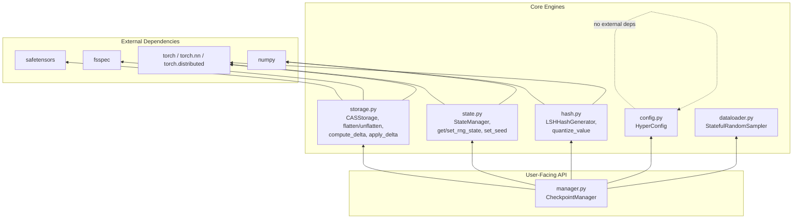

# Syckpt Architecture Overview

This document is the structural map of the entire `syckpt` codebase. It describes what each module does, how they depend on each other, and traces the complete data flow from a user calling `ckpt.save()` through to bytes landing on disk — and the reverse path for `ckpt.load()`.

---

## Module Dependency Map



### Module Responsibilities

| Module | File | Lines | Responsibility |
|---|---|---|---|
| **`manager.py`** | `syckpt/manager.py` | 855 | Top-level orchestrator. Implements `CheckpointManager` (registration, save/load, branching, DDP sync, async forking), `Commit` (data class), `Lock` (fcntl file lock), and `create_checkpoint` factory. |
| **`storage.py`** | `syckpt/storage.py` | 275 | Filesystem layer. Implements `CASStorage` (Git-like object store over fsspec), `flatten_state`/`unflatten_state` (nested dict ↔ flat tensor dict), `compute_delta`/`apply_delta` (element-wise tensor diffing with frozen-layer detection). |
| **`state.py`** | `syckpt/state.py` | 203 | State aggregation. Implements `StateManager` (dynamic component registry with duck-typed `.state_dict()` probing), `get_rng_state`/`set_rng_state` (captures/restores Python, NumPy, PyTorch CPU, PyTorch CUDA, and `torch.compile` PRNG states), `set_seed`, `get/set_deterministic_state`. |
| **`hash.py`** | `syckpt/hash.py` | 250 | Hashing engine. Implements `LSHHashGenerator` (Locality-Sensitive Hashing via random hyperplane projections for cosine-distance-preserving hash generation), `quantize_value`/`quantize_dict` (Distance-Sensitive log-scale quantization), `similarity` (Hamming distance), `find_similar_configs`. |
| **`config.py`** | `syckpt/config.py` | 162 | Configuration proxy. Implements `HyperConfig` (a `collections.abc.Mapping` subclass that stores nested dicts as dot-notation flat keys internally, with `__getattr__`/`__setattr__` intercepts for transparent `config.model.layers` access). |
| **`dataloader.py`** | `syckpt/dataloader.py` | 52 | Dataloader resumption. Implements `StatefulRandomSampler` (subclasses `torch.utils.data.Sampler`, uses an explicitly seeded `torch.Generator` for deterministic epoch permutations, and achieves $O(1)$ crash resumption via Python list slicing). |
| **`__init__.py`** | `syckpt/__init__.py` | 21 | Public API surface. Re-exports `CheckpointManager`, `Commit`, `HyperConfig`, `LSHHashGenerator`, `set_seed`, `get_rng_state`, `set_rng_state`. |

---

## End-to-End Data Flow: `save()`

This traces every function call from the moment a user calls `ckpt.save()` to the moment bytes hit disk.

### Phase 1: DDP Synchronization (Lines 539–573 of `manager.py`)

```
ckpt.save()
│
├─ If torch.distributed is initialized:
│   ├─ dist.barrier()                       # All GPUs halt until everyone arrives
│   ├─ Rank 0: _generate_hash()            # LSH hash from config + model + optimizer
│   ├─ dist.broadcast_object_list([hash])   # Beam hash to Ranks 1..N
│   ├─ dist.gather_object(rng_state)        # Ranks 1..N ship their PRNG states to Rank 0
│   └─ Ranks 1..N: return hash immediately  # Workers resume training
│
└─ If single-GPU:
    └─ _generate_hash()
```

### Phase 2: State Collection & Flattening (Lines 319–334 of `manager.py`, Lines 13–57 of `storage.py`)

```
_build_commit_data()
│
├─ StateManager.build_state()
│   └─ For each registered component:
│       ├─ obj.state_dict()    # Models, Optimizers, Schedulers, Samplers
│       ├─ obj.state()         # Fallback for non-standard objects
│       └─ obj.bit_generator.state  # NumPy Generators
│
├─ flatten_state(components_state)
│   ├─ Recursively walk the nested dict
│   ├─ Extract every torch.Tensor → flat_tensors["model.layer1.weight"]
│   ├─ Replace tensor in structure with {"__tensor__": "model.layer1.weight"}
│   ├─ Wrap tuples as {"__tuple__": [...]}
│   └─ Return (json_structure, flat_tensors_dict)
│
├─ get_rng_state()              # Capture Python/NumPy/Torch/CUDA PRNGs
└─ get_deterministic_state()    # Capture cuDNN deterministic/benchmark flags
```

### Phase 3: CPU Migration & Async Fork (Lines 597–636 of `manager.py`)

```
# Clone all tensors from GPU VRAM to CPU RAM
cpu_tensors = {k: v.to("cpu", non_blocking=True).clone() for k, v in flat_tensors.items()}

# Fork a child OS process (bypasses GIL entirely)
multiprocessing.Process(target=_async_save_worker, args=(...))
│
├─ Parent (Rank 0): returns hash immediately → GPU resumes training
│
└─ Child process (_async_save_worker):
    ├─ Load base tensors from parent commit (if exists)
    ├─ compute_delta(current_tensors, base_tensors)
    │   ├─ For each tensor key:
    │   │   ├─ torch.equal(current, base) → True?  →  {"__frozen__": key}
    │   │   └─ Different? → current - base  (element-wise delta)
    │   └─ Return delta_map dict
    │
    ├─ CASStorage.save_tensors(tensors, blob_hash, base_tensors)
    │   ├─ Separate frozen links from pure tensor deltas
    │   ├─ save_file(pure_tensors, tmp_path)    # Safetensors serialization
    │   └─ fsspec.put_file(tmp_path, final_path) # Atomic write
    │
    ├─ CASStorage.save_commit(hash, commit_data) # Write JSON metadata
    ├─ CASStorage.write_ref(branch, hash)        # Update branch pointer
    └─ CASStorage.write_head(branch)             # Update HEAD
```

### Phase 4: What the Commit JSON Looks Like

```json
{
    "hash": "a3f8c1d2",
    "parent": "b7e2f4a1",
    "message": "epoch-3",
    "step": 1500,
    "epoch": 3,
    "batch_idx": 0,
    "branch": "main",
    "config": {"lr": 0.001, "batch_size": 64},
    "components_structure": {
        "model": {
            "layer1.weight": {"__tensor__": "model.layer1.weight"},
            "layer1.bias": {"__tensor__": "model.layer1.bias"}
        },
        "optimizer": {
            "state": {"0": {"momentum_buffer": {"__tensor__": "optimizer.state.0.momentum_buffer"}}}
        }
    },
    "rng": {
        "torch_rng": [...],
        "cuda_rng": [...],
        "numpy_rng": [...],
        "python_rng": [...]
    },
    "deterministic": {"cudnn_deterministic": true, "cudnn_benchmark": false},
    "blob_metadata": {
        "blob_hash": "a3f8c1d2",
        "is_delta": true,
        "frozen_links": {
            "model.layer1.weight": "model.layer1.weight"
        }
    },
    "metric": 0.342
}
```

---

## End-to-End Data Flow: `load()` / Auto-Resume

```
CheckpointManager.__enter__()     # or explicit ckpt.load(hash)
│
├─ storage.read_ref("main")      # → "a3f8c1d2"
├─ storage.load_commit("a3f8c1d2") # → JSON metadata
│
├─ _fetch_tensors("a3f8c1d2")
│   ├─ Is this commit a delta? (blob_metadata.is_delta == True)
│   │   ├─ Yes → recurse: _fetch_tensors(parent="b7e2f4a1")
│   │   │   └─ Eventually reaches a non-delta base commit
│   │   ├─ storage.load_tensors(blob_hash, base_tensors, is_delta=True, frozen_links)
│   │   │   ├─ load_file() → Safetensors deserialization
│   │   │   ├─ Inject frozen_links back as {"__frozen__": key}
│   │   │   └─ apply_delta(base, delta_map)
│   │   │       ├─ __frozen__ → clone from base (identity)
│   │   │       ├─ Delta tensor → base[k] + delta[k]
│   │   │       └─ New tensor → use as-is
│   │   └─ Return reconstructed flat_tensors
│   └─ No → storage.load_tensors(blob_hash, is_delta=False)
│
├─ _restore_commit_data(metadata, flat_tensors)
│   ├─ Restore step, epoch, batch_idx, branch, config
│   ├─ unflatten_state(components_structure, flat_tensors)
│   │   └─ Walk JSON, replace {"__tensor__": key} with flat_tensors[key]
│   ├─ StateManager.restore_state(components)
│   │   └─ For each component: obj.load_state_dict(state)
│   ├─ set_rng_state(rng)     # Restore all 4 PRNG backends
│   └─ set_deterministic_state(deterministic)
│
└─ Logger: "Resumed from step X, batch Y"
```

---

## Component Deep-Dives

For line-by-line code walkthroughs and the underlying mathematics, see the following guides:

1.  **[`syckpt/storage.py`: Content-Addressable Storage & Delta Compression](./storage_and_cas.md)**
    * Git work-tree anatomy, Merkle DAGs, `flatten_state`/`unflatten_state` algorithm, SGD delta mathematics, `torch.equal` frozen-layer detection, `CASStorage` class with fsspec atomic writes.

2.  **[`syckpt/manager.py`: Orchestration & PyTorch DDP Synchronization](./manager_and_ddp.md)**
    * DDP All-Reduce mechanics, `dist.barrier()`/`broadcast_object_list()`/`gather_object()`, async `multiprocessing.Process` fork bypassing the GIL, `__setattr__` proxy, `fcntl` file locking, `export_ckpt` monolithic export.

3.  **[`syckpt/config.py` & `syckpt/hash.py`: Configuration & LSH Bucketing](./config_and_lsh.md)**
    * LSH random hyperplane geometry, cosine-distance approximation proof, Distance-Sensitive log-scale quantization, `LSHHashGenerator` full walkthrough, `HyperConfig` flattening proxy.

4.  **[`syckpt/dataloader.py`: Slicing Iterators & Exact Resumption](./dataloader_and_resumption.md)**
    * Catastrophic forgetting, `StatefulRandomSampler` line-by-line, $O(1)$ Python list-slicing proof, deterministic epoch seeding.

5.  **[`syckpt/state.py`: PRNG Aggregation & The Seeds of Randomness](./state_aggregation.md)**
    * PRNGs (LCG, Mersenne Twister, PCG64, CUDA Philox), `get_rng_state`/`set_rng_state` line-by-line, `StateManager` duck-typed component probing.
